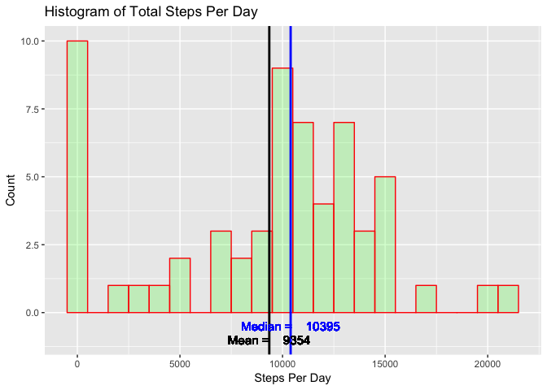
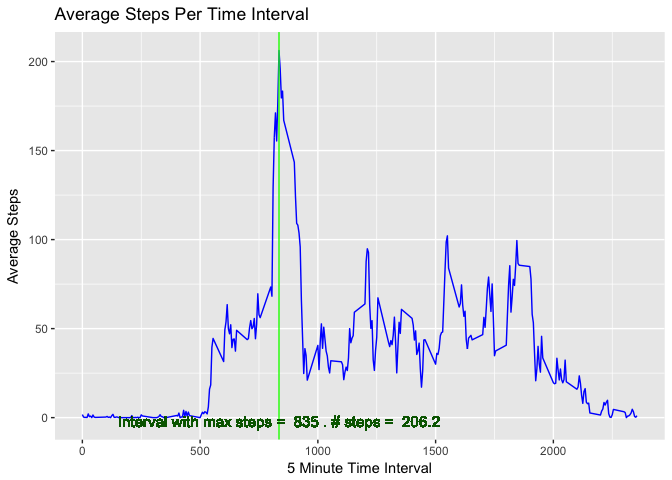
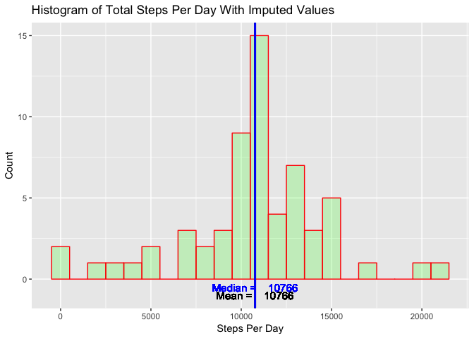
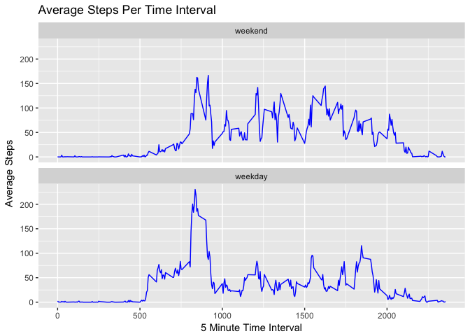

## Loading and preprocessing the data
The data is in the file *activity.zip* so first of all open the zip file and read in the data.  I use a *str* command to show the structure and size of the data that results.


```r
myData <- read.csv(unz("activity.zip","activity.csv"), header = TRUE,na.strings="NA")
str(myData)
```

```
## 'data.frame':	17568 obs. of  3 variables:
##  $ steps   : int  NA NA NA NA NA NA NA NA NA NA ...
##  $ date    : Factor w/ 61 levels "2012-10-01","2012-10-02",..: 1 1 1 1 1 1 1 1 1 1 ...
##  $ interval: int  0 5 10 15 20 25 30 35 40 45 ...
```

I really want the date strings converted to dates so use the following code to perform the conversion. Use of a *str* command again demonstrates the changes made.


```r
myData$date <- as.Date(myData$date, format = "%Y-%m-%d")
str(myData)
```

```
## 'data.frame':	17568 obs. of  3 variables:
##  $ steps   : int  NA NA NA NA NA NA NA NA NA NA ...
##  $ date    : Date, format: "2012-10-01" "2012-10-01" ...
##  $ interval: int  0 5 10 15 20 25 30 35 40 45 ...
```

## What is mean total number of steps taken per day?

In this phase we are going to ignore the NA values in the *steps* variable.

All charts will be drawn with *ggplot2* so we need to start with a library call for this package.  Then we need to total the number of steps by day (ignoring NA values) and then show the data in a histogram.

The mean and median of the total steps per day are calculated and displayed on the chart directly.  The values are also displayed as a table after the chart.


```r
library(ggplot2)
sumByDay <- aggregate(steps~date, myData, FUN = sum, na.rm=TRUE, na.action="na.pass")
meanSteps <- mean(sumByDay$steps)
medianSteps <- median(sumByDay$steps)
ggplot(data=sumByDay, aes(sumByDay$steps)) + 
   geom_histogram(binwidth = 1000,
                  col="red", 
                  fill="green", 
                  alpha = .2) + 
   labs(title="Histogram of Total Steps Per Day") +
   labs(x="Steps Per Day", y="Count") +
   geom_vline(aes(xintercept = meanSteps), col='black', size = 1) +
   geom_vline(aes(xintercept = medianSteps), col='blue', size = 1) +
   geom_text(aes(label=paste("Mean =   ", round(meanSteps,0)),y=-1,x=meanSteps),
            col='black',size=4) +
   geom_text(aes(label=paste("Median =   ", round(medianSteps,0)),y=-0.5,x=medianSteps),
            col='blue',size=4)
```

<!-- -->

```r
summary(sumByDay$steps)[c(3,4)]
```

```
##   Median     Mean 
## 10395.00  9354.23
```


## What is the average daily activity pattern?

Once again we are going to ignore the NA values in the *steps* variable.

First we average the number of steps by day (ignoring NA values) split into the 5 minute intervals and then show the data as a line chart.

The time interval with the highest average number of steps is shown on the chart and following that in table form.


```r
avgByInterval <- aggregate(steps~interval, myData, FUN = mean, na.rm=TRUE, na.action="na.pass")
maxTime <- avgByInterval[which.max(avgByInterval$steps),]
ggplot(data=avgByInterval, aes(x=interval, y=steps, group=1)) +
   geom_line(col = "blue") +
   labs(title="Average Steps Per Time Interval") +
   labs(x="5 Minute Time Interval", y="Average Steps") +
   geom_vline(aes(xintercept = maxTime$interval), col='green', size = 0.5) +
   geom_text(aes(label=paste("Interval with max steps = ", maxTime$interval, ". # steps = ",                     round(maxTime$steps,1)),y=-2,x=maxTime$interval), col='dark green',size=4) 
```

<!-- -->

```r
maxTime[c(1,2)]
```

```
##     interval    steps
## 104      835 206.1698
```

## Imputing missing values

First of all let's determine the number of rows with missing values in each of the data variables.


```r
whichHaveMissingValues <- !complete.cases(myData)
sum(whichHaveMissingValues)
```

```
## [1] 2304
```

We need a way to impute values for the days/intervals with missing number of steps.  There are many ways to do this but I have chosen to replace a missing value with the avg number of steps across all days for the given time interval.  We calculated this earlier - it is held in the array *avgByInterval*.

Let's create a new data set with the missing values replaced with the above imputed values.  I've included a call to *summary* to show there are no NA values anymore.


```r
fullMyData <- myData
fullMyData$steps <- ifelse(is.na(fullMyData$steps), avgByInterval$steps[as.factor(fullMyData$interval)], fullMyData$steps)
summary(fullMyData)
```

```
##      steps             date               interval     
##  Min.   :  0.00   Min.   :2012-10-01   Min.   :   0.0  
##  1st Qu.:  0.00   1st Qu.:2012-10-16   1st Qu.: 588.8  
##  Median :  0.00   Median :2012-10-31   Median :1177.5  
##  Mean   : 37.38   Mean   :2012-10-31   Mean   :1177.5  
##  3rd Qu.: 27.00   3rd Qu.:2012-11-15   3rd Qu.:1766.2  
##  Max.   :806.00   Max.   :2012-11-30   Max.   :2355.0
```

Now that we have the data with imputed values let's rechart the histogram of total steps per day and recalculate the mean and medians.


```r
sumByDayWithImputed <- aggregate(steps~date, fullMyData, FUN = sum)
meanStepsWithImputed <- mean(sumByDayWithImputed$steps)
medianStepsWithImputed <- median(sumByDayWithImputed$steps)
ggplot(data=sumByDayWithImputed, aes(sumByDayWithImputed$steps)) + 
   geom_histogram(binwidth = 1000,
                  col="red", 
                  fill="green", 
                  alpha = .2) + 
   labs(title="Histogram of Total Steps Per Day With Imputed Values") +
   labs(x="Steps Per Day", y="Count") +
   geom_vline(aes(xintercept = meanStepsWithImputed), col='black', size = 1) +
   geom_vline(aes(xintercept = medianStepsWithImputed), col='blue', size = 1) +
   geom_text(aes(label=paste("Mean =   ", round(meanStepsWithImputed,0)),y=-1,x=meanStepsWithImputed),
            col='black',size=4) +
   geom_text(aes(label=paste("Median =   ",round(medianStepsWithImputed,0)),y=-0.5,x=medianStepsWithImputed),
            col='blue',size=4)
```

<!-- -->

```r
summary(sumByDayWithImputed$steps)[c(3,4)]
```

```
##   Median     Mean 
## 10766.19 10766.19
```

Using the average steps per time interval as the imputed values has moved the mean and median to be the same value.  In addition, using imputed values has resulted in far less days with no steps and shifted the balance of the histogram slightly to the right.

## Are there differences in activity patterns between weekdays and weekends?

Note: I'm using the dataset with imputed values here.

First let's add a new factor variable that states if the date is a 'weekday' or 'weekend'.


```r
weekdayNames <- c('Monday', 'Tuesday', 'Wednesday', 'Thursday', 'Friday')
fullMyData$dayType <- factor((weekdays(fullMyData$date) %in% weekdayNames), levels=c(FALSE, TRUE), labels=c('weekend', 'weekday'))
str(fullMyData)
```

```
## 'data.frame':	17568 obs. of  4 variables:
##  $ steps   : num  1.717 0.3396 0.1321 0.1509 0.0755 ...
##  $ date    : Date, format: "2012-10-01" "2012-10-01" ...
##  $ interval: int  0 5 10 15 20 25 30 35 40 45 ...
##  $ dayType : Factor w/ 2 levels "weekend","weekday": 2 2 2 2 2 2 2 2 2 2 ...
```

Now let's see if there are differences in activity levels on weekends and weekdays.  I will use a facet grid to display the two results together.


```r
avgByIntervalWithImputed <- aggregate(steps~interval+dayType, fullMyData, FUN = mean)
ggplot(data=avgByIntervalWithImputed, aes(x=interval, y=steps, group=1)) +
   geom_line(col = "blue") +
   labs(title="Average Steps Per Time Interval") +
   labs(x="5 Minute Time Interval", y="Average Steps") +
   facet_wrap( ~ dayType, ncol=1)
```

<!-- -->
